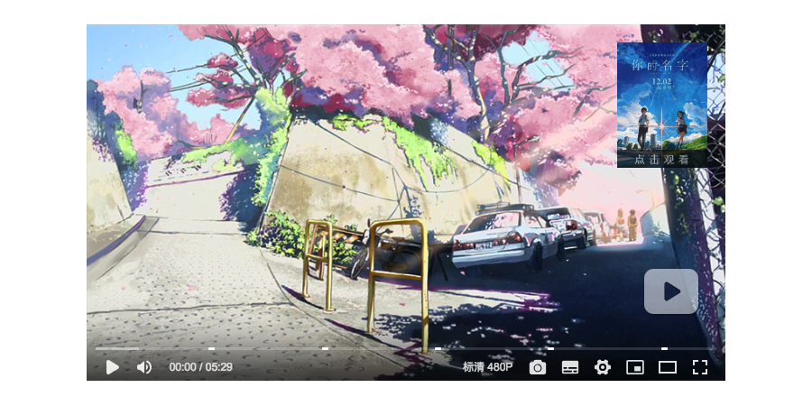

# ArtPlayer

[](https://www.travis-ci.org/zhw2590582/ArtPlayer)


> ArtPlayer is a modern HTML5 video player



## Features

> TODO...

## Demo

[Checkout the demo](https://blog.zhw-island.com/ArtPlayer/lab) from Github Pages

## Document

[Checkout the Document](https://blog.zhw-island.com/ArtPlayer/docs) from Github Pages

## Install

Install with `npm`

```
$ npm install artplayer
```

Or install with `yarn`

```
$ yarn add artplayer
```

```js
import Artplayer from 'artplayer';
import 'artplayer/dist/artplayer.css';
```

Or umd builds are also available

```html
<link rel="stylesheet" href="path/to/artplayer.css" />
<script src="path/to/artplayer.js"></script>
```

Will expose the global variable to `window.Artplayer`.

## Usage

```html
<div class="artplayer-app"></div>
```

```js
var art = new Artplayer({
    container: '.artplayer-app',
    url: 'path/to/video.mp4',
});
```

## Ecosystem

| Project                                                                                                          | Description                   |
| ---------------------------------------------------------------------------------------------------------------- | ----------------------------- |
| [artplayer-plugin-danmu](https://github.com/zhw2590582/ArtPlayer/tree/master/packages/artplayer-plugin-danmu)    | Danmu plugin for ArtPlayer    |
| [artplayer-plugin-subtitle](https://github.com/zhw2590582/ArtPlayer/tree/master/packages/artplayer-plugin-subtitle) | Subtitle plugin for ArtPlayer |

## QQ Group


## License

MIT © [Harvey Zack](https://www.zhw-island.com/)
