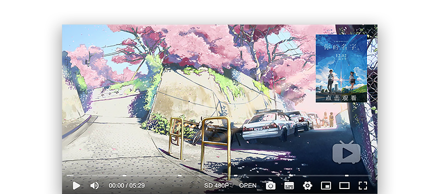

# ArtPlayer.js

-   [中文介绍](./README-CN.md)

> :art: ArtPlayer.js is a modern and full featured HTML5 video player


[](https://www.npmjs.com/package/artplayer)
[](https://www.codacy.com/app/zhw2590582/ArtPlayer?utm_source=github.com&utm_medium=referral&utm_content=zhw2590582/ArtPlayer&utm_campaign=Badge_Grade)



## Features

-   <b>Size</b> - `25kB` minified and gzipped
-   <b>Subtitle</b> - Support for `.VTT`, `.ASS` and `.SRT` formats
-   <b>Customizable</b> - `Right Click Menu`, `Business Layer`, `Video Controller` and `Settings Panel`
-   <b>Controller</b> - `Quality Switch`, `Subtitle Switch`, `Play Speed`, `Aspect Ratio`, `Video Flip`, `Fullscreen`, `Picture In Picture`, `Screenshot`, `Thumbnail`, `Adaptive Size`, `Highlight` and `Hotkey`...
-   <b>Built-in</b> - `Open Local Subtitles`, `Open Local Video`, `Mini Progress Bar`, `Network Detection` and `Subtitle Time Offset`
-   <b>Integration</b> - Easy to integration with other dependencies: `flv.js`, `hls.js`, `dash.js`, `shaka-player`, `webtorrent`...
-   <b>Code</b> - Vanilla `ES6` and `SASS`, Highly decoupled code, clear structure, easy to track bugs and add new features
-   <b>Document</b> - Detailed interface documentation and rich code demo
-   <b>API</b> - Rich interface and response events, easy to interface with business or custom plugin
-   <b>I18N</b> - support for internationalization of controls

## Ecosystem

| Project                                                                                                               | Description         | Demo                                                                                                                                        |
| --------------------------------------------------------------------------------------------------------------------- | ------------------- | ------------------------------------------------------------------------------------------------------------------------------------------- |
| [artplayer-plugin-danmuku](https://github.com/zhw2590582/ArtPlayer/tree/master/packages/artplayer-plugin-danmuku)     | Danmuku plugin      | [demo](https://artplayer.org/?libs=.%2Funcompiled%2Fartplayer-plugin-danmuku.js&example=danmuku)                                            |
| [artplayer-plugin-gif](https://github.com/zhw2590582/ArtPlayer/tree/master/packages/artplayer-plugin-gif)             | Gif plugin          | [demo](https://artplayer.org/?libs=.%2Funcompiled%2Fartplayer-plugin-gif.js&example=gif)                                                    |
| [artplayer-plugin-backlight](https://github.com/zhw2590582/ArtPlayer/tree/master/packages/artplayer-plugin-backlight) | Backlight plugin    | [demo](https://artplayer.org/?libs=.%2Funcompiled%2Fartplayer-plugin-backlight.js&example=backlight)                                        |
| [artplayer-tool-thumbnail](https://github.com/zhw2590582/ArtPlayer/tree/master/packages/artplayer-tool-thumbnail)     | Thumbnail tool      | [demo](https://artplayer.org/?libs=.%2Funcompiled%2Fartplayer-tool-thumbnail.js&example=thumbnail)                                          |
| [artplayer-tool-github](https://github.com/zhw2590582/ArtPlayer/tree/master/packages/artplayer-tool-github)           | Github Danmuku tool | [demo](https://artplayer.org/?libs=.%2Funcompiled%2Fartplayer-tool-github.js%0A.%2Funcompiled%2Fartplayer-plugin-danmuku.js&example=github) |  |
| [artplayer-react](https://github.com/zhw2590582/ArtPlayer/tree/master/packages/artplayer-react)                       | React Component     | [demo](https://codesandbox.io/s/n74859y9rl)                                                                                                 |
| [artplayer-vue](https://github.com/zhw2590582/ArtPlayer/tree/master/packages/artplayer-vue)                           | Vue Component       | [demo](https://codesandbox.io/s/thirsty-sunset-3lz7m)                                                                                       |

## Homepage

[https://artplayer.org](https://artplayer.org)

## Mobile Demo


## Document

[https://artplayer.org/document](https://artplayer.org/document)

## Install

Install with `npm`:

```bash
$ npm install artplayer
```

Or install with `yarn`:

```bash
$ yarn add artplayer
```

```js
import Artplayer from 'artplayer';
```

Or umd builds are also available:

```html
<script src="path/to/artplayer.js"></script>
```

Or from jsDelivr CDN:

```html
<script src="https://cdn.jsdelivr.net/npm/artplayer/dist/artplayer.js"></script>
```

Will expose the global variable to `window.Artplayer`.

## Usage

```html
<div class="artplayer-app"></div>
```

```js
var art = new Artplayer({
    container: '.artplayer-app',
    url: 'path/to/video.mp4',
});
```

## Contribution

Installation dependency:

```bash
$ npm install
$ npm run bootstrap
```

Run the developer mode and select the project you want to develop:

```bash
$ npm run dev
```

Open web server:

```bash
$ npm start
```

## Donations

We accept donations through these channels:


-   [Patreon](https://www.patreon.com/artplayer)
-   [Paypal](https://www.paypal.me/harveyzack)

## QQ Group


## License

MIT © [Harvey Zack](https://sleepy.im/)
